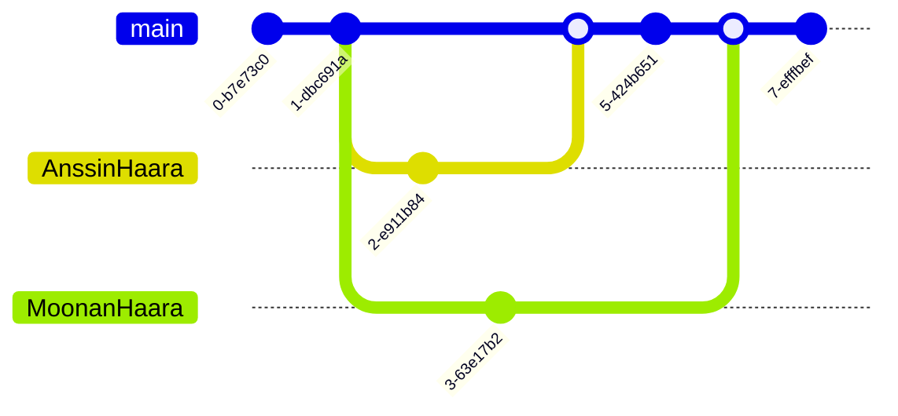

# Git_and_GitHub_ohjeet

# :smile: 1. Yleistä :smile:

### 1.1 Versiohallinta

  
  

Versiohallinta on menetelmä, jolla säilötään tietoa ja siihen tehtyjä muutoksia. Tärkeimmät syyt sen käyttöön ovat:

    Varmuuskopiointi: Kaikki muutokset tallennetaan.
    Yhteistyö ja tiedonjako: Mahdollistaa työskentelyn samassa projektissa eri laitteilla ja käyttäjien välillä.

### 1.2 Git

Git on hajautettu versiohallintajärjestelmä, jonka Linus Torvalds kehitti. Se säilyttää tietoja ja pitää kirjaa muutoksista, mahdollistaen yhteistyön ja versionhallinnan.

Git koostuu kolmesta osasta:

    Työkansio: Varsinaiset tiedostot.
    Indeksi: Muutosten välitallennuspaikka.
    Paikallinen repositorio: Kaikki versiot tallennettuna.

### 1.3 GitHub

GitHub on pilvipalvelu, joka mahdollistaa Git-repositorioiden säilytyksen ja jakamisen. Se toimii myös varmuuskopiona tiedoille.

Peruskäyttö:

    Repositorioiden luominen ja hallinta paikallisesti ja pilvessä.
    Synkronointi paikallisen ja etärepositorion välillä:
    Lähetys GitHubiin: git push
    Tietojen hakeminen GitHubista: git pull

# 2. Git-komennot

### 2.1 Yleiset komennot:

    Repositorio käyttöön: git init
    Muutosten lisääminen: git add
    Commitin luominen: git commit -m "viesti"
    Tilan tarkistus: git status
    Historian tarkistus: git log

### 2.2 Branch (haarat):

    Uusi haara: git branch nimi
    Haaran yhdistäminen päähaaraan: git merge nimi
    Haaran poistaminen: git branch -d nimi
    
Esimerkki haaroista:

    
### 2.3 Fork ja Upstream

Fork: Kopio toisen käyttäjän repositoriosta.
Upstream: Alkuperäisen repositorion synkronointi paikalliseen hakemistoon:

    Lisää: git remote add upstream <URL>
    Synkronoi: git fetch upstream

Tiivistäen, Git ja GitHub ovat olennaisia työkaluja yhteistyöskentelyyn ja varmuuskopiointiin ohjelmistokehityksessä.
---

